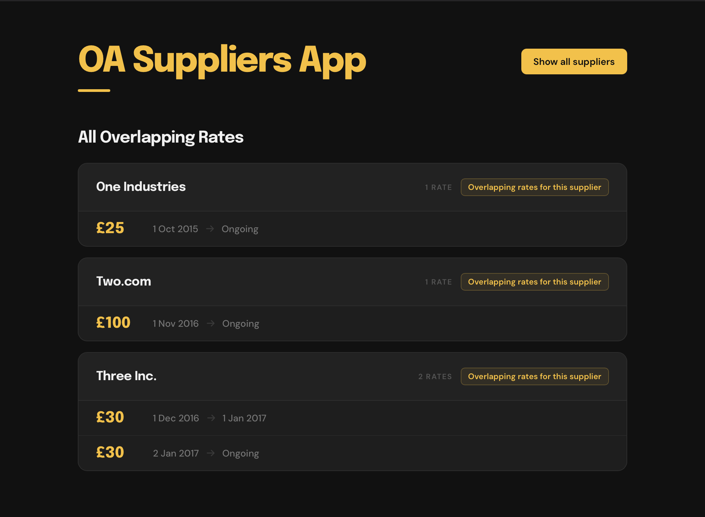

# OA Supplier App

A supplier rate management tool. View suppliers and their pricing rates, and identify suppliers with overlapping rate periods.



## Structure

```
/
├── api/      Express API (Node.js + SQLite)
├── fe/       React frontend (Vite + RTK Query)
├── .env      Shared secrets — gitignored, generated by setup.sh
└── setup.sh  First-time setup script
```

## Setup

Run once after cloning:

```sh
./setup.sh
```

This will:
1. Install dependencies in both `api/` and `fe/`
2. Create and seed the SQLite database
3. Generate `.env` with a random `SHARED_SECRET`

## Running

Start both apps in separate terminals:

```sh
npm run dev --prefix api   # http://localhost:3000
npm run dev --prefix fe    # http://localhost:5173
```

The frontend proxies `/suppliers` and `/overlaps` requests to the API via the Vite dev server, so no CORS configuration is needed in development.

## Environment

Both apps read from a single `.env` at the project root.

| Variable            | Used by    | Purpose                              |
|---------------------|------------|--------------------------------------|
| `SHARED_SECRET`     | API        | Validates incoming bearer tokens     |
| `VITE_SHARED_SECRET`| Frontend   | Sent as `Authorization: Bearer` header |

> Both variables must hold the same value. `setup.sh` handles this automatically.
> WARNING: while this is fine for local use this IS NOT production-ready – a live version of this should use JWT or similar as the VITE_SHARED_SECRET is sent in the Bearer header currently

## API

**Base URL:** `http://localhost:3000`

All routes except `/` require an `Authorization: Bearer <SHARED_SECRET>` header.

| Method | Route              | Description                                      |
|--------|--------------------|--------------------------------------------------|
| GET    | `/`                | Health check                                     |
| GET    | `/suppliers`       | All suppliers with their rates                   |
| GET    | `/suppliers/:id`   | Single supplier with rates                       |
| GET    | `/overlaps`        | Suppliers that have overlapping rate periods     |
| GET    | `/overlaps/:id`    | Suppliers overlapping with a specific supplier   |

### Database

SQLite database at `api/data.db` (gitignored). Schema:

- **Supplier** — `SupplierId`, `Name`, `Address`, `CreatedByUser`, `CreatedOn`
- **SupplierRate** — `SupplierRateId`, `SupplierId`, `Rate`, `RateStartDate`, `RateEndDate` (null = ongoing)

Reset and reseed the database:

```sh
npm run reset --prefix api
```

## Frontend

**URL:** `http://localhost:5173`

Built with React, Redux Toolkit, and RTK Query. Two views, toggled by a button in the header:

- **Suppliers** — lists all suppliers and their rate history
- **Overlaps** — lists only suppliers with overlapping rate periods; clicking a supplier shows which others it overlaps with

## Testing

```sh
# API — Vitest + Supertest
npm test --prefix api
npm run test:watch --prefix api

# Frontend — Vitest + Testing Library + MSW
npm test --prefix fe
npm run test:coverage --prefix fe
```
